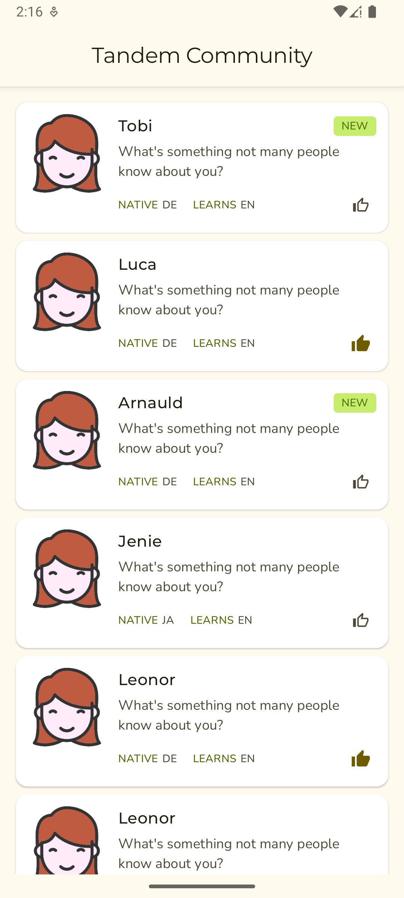
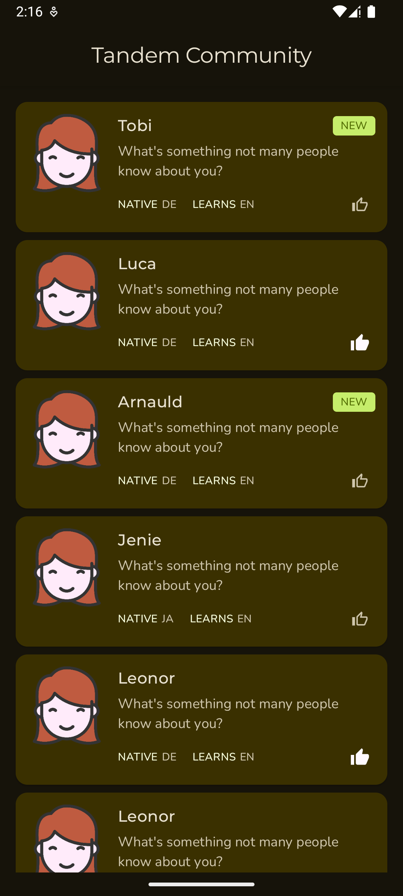
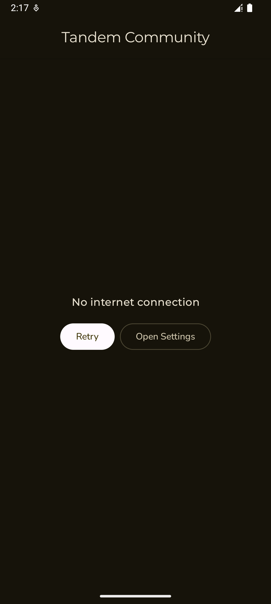

# TandemCommunity

A production-quality Android app that displays a paginated community feed, lets users like members, and handles network errors and connectivity changes gracefully. Built as a showcase of Clean Architecture, Jetpack Compose, and modern Android engineering practices.

---

## Screenshots

| Community Feed | Dark Mode | Error State | Empty State |
|:-:|:-:|:-:|:-:|
|  |  |  |  |


---

## Architecture

The app follows **Clean Architecture** with three strictly separated layers. Dependencies only point inward — the domain layer has zero Android dependencies.

```
┌─────────────────────────────────────────────────────────┐
│                    Presentation Layer                    │
│                                                         │
│   MainActivity  ──►  TandemCommunityTheme               │
│        │                                                │
│        ▼                                                │
│   CommunityScreen                                       │
│   ├── CommunityMemberCard                               │
│   ├── MemberList                                        │
│   ├── ErrorScreen                                       │
│   └── EmptyContent                                      │
│        │                                                │
│        ▼                                                │
│   CommunityViewModel                                    │
│   ├── members: Flow<PagingData<CommunityMember>>        │
│   ├── ConnectivityObserver (auto-refresh on reconnect)  │
│   └── EventLogger (analytics)                           │
└──────────────────────┬──────────────────────────────────┘
                       │  domain interfaces only
┌──────────────────────▼──────────────────────────────────┐
│                      Domain Layer                        │
│                  (no Android deps)                       │
│                                                         │
│   GetCommunityMembersUseCase                            │
│   └── combine(PagingData, likedIds) → CommunityMember   │
│                                                         │
│   ToggleLikeUseCase                                     │
│                                                         │
│   Models: CommunityMember · CommunityUser · CommunityError│
│   Interfaces: CommunityRepository · LikedRepository     │
│               ConnectivityObserver · EventLogger        │
└──────────────────────┬──────────────────────────────────┘
                       │  implements interfaces
┌──────────────────────▼──────────────────────────────────┐
│                       Data Layer                         │
│                                                         │
│   CommunityRepositoryImpl                               │
│   └── CommunityPagingSource  ──►  CommunityApi (Retrofit)│
│        └── UserDto ──► CommunityUser (mapper)           │
│                                                         │
│   LikedRepositoryImpl                                   │
│   └── LikedUserDao  ──►  AppDatabase (Room)             │
│                                                         │
│   NetworkConnectivityObserver (ConnectivityManager)     │
│   LogcatEventLogger                                     │
└─────────────────────────────────────────────────────────┘
```

### Key Data Flow — Community Feed

```
CommunityPagingSource          LikedRepositoryImpl
        │                              │
  Retrofit pages               Room Flow<Set<Long>>
        │                              │
        └──────────┬───────────────────┘
                   ▼
     GetCommunityMembersUseCase.combine()
                   │
          Flow<PagingData<CommunityMember>>
                   │
           CommunityViewModel
                   │
           CommunityScreen (LazyColumn)
```

### Error Handling

Two distinct error paths prevent mid-scroll list collapse:

| Error type | How surfaced |
|---|---|
| **Refresh** (first load / pull-to-refresh) | `LoadResult.Error` → full-screen `ErrorScreen` |
| **Append** (mid-scroll pagination) | `appendErrorFlow` SharedFlow → Snackbar with Retry |

`CommunityError` is a sealed class: `NoConnectivity`, `Timeout`, `HttpError(code)`, `Unknown`.

### Connectivity Recovery

`ConnectivityObserver` emits on every network change. The ViewModel uses `.drop(1).filter { it }` to skip the initial emission and only act on reconnection events, triggering an automatic refresh or retry depending on the current error state.

---

## Tech Stack

| Area | Library |
|---|---|
| UI | Jetpack Compose + Material3 |
| Typography | Montserrat (display) · Nunito (body) — bundled TTF |
| Networking | Retrofit 3 · OkHttp 5 · kotlinx.serialization |
| Local DB | Room 3 (alpha) · BundledSQLiteDriver |
| Paging | Paging 3 (`paging-compose`) |
| Images | Coil 3 (`coil-network-okhttp`) |
| DI | Koin 4 |
| Analytics | `EventLogger` interface · `LogcatEventLogger` impl |
| Memory leaks | LeakCanary (debug only) |
| Static analysis | Detekt |

---

## Getting Started

### Prerequisites

- Android Studio Meerkat or later
- JDK 17+
- Android device or emulator running API 24+

### Build & Run

```bash
# Debug build
./gradlew assembleDebug

# Install on connected device / emulator
./gradlew installDebug

# Run unit tests
./gradlew test

# Lint
./gradlew lint

# Static analysis
./gradlew detekt
```

---

## Testing Policy

Tests live in `app/src/test/` and cover the data and domain layers. There are no UI tests for ViewModels currently; ViewModel logic is validated indirectly through use case tests.

### Framework

| Tool | Purpose |
|---|---|
| JUnit 4 | Test runner (`@Test`, `@Before`) |
| MockK | Mocking (`mockk`, `coEvery`, `coVerify`) |
| `kotlinx-coroutines-test` | `runTest`, `UnconfinedTestDispatcher` |
| `paging-testing` | `asSnapshot()` to collect `PagingData` as a list |

### Conventions

- **Test names** — backtick strings: `` `load returns NoConnectivity error when api throws IOException` ``
- **Structure** — related tests grouped under `// region <method>()` / `// endregion`
- **Fake builders** — each test file defines its own private `fakeXxx()` functions; no shared fixtures
- **No mocked databases** — data-layer tests mock the API/DAO interface directly, not a database driver

### Coverage by layer

| Layer | What is tested |
|---|---|
| **Data** | `CommunityPagingSource` (all error branches), `CommunityRepositoryImpl`, `LikedRepositoryImpl` |
| **Domain** | `GetCommunityMembersUseCase` (combine, liked merge), `ToggleLikeUseCase` |
| **Presentation** | — (covered indirectly via use case tests) |

---

## Design System

All values come from the theme — no hardcoded `dp` literals or color hex values in composables.

### Spacing (`Spacing.kt`)

| Token | Value |
|---|---|
| `Spacing.xxs` | 2 dp |
| `Spacing.xs` | 4 dp |
| `Spacing.sm` | 8 dp |
| `Spacing.md` | 12 dp |
| `Spacing.lg` | 16 dp |
| `Spacing.xl` | 24 dp |

### Dimensions (`Dimens.kt`)

| Token | Value | Use |
|---|---|---|
| `Dimens.avatarSize` | 80 dp | Profile image |
| `Dimens.avatarCornerRadius` | 8 dp | Avatar clip |
| `Dimens.badgeCornerRadius` | 4 dp | "New" badge |
| `Dimens.likeButtonSize` | 32 dp | Like touch target |
| `Dimens.likeIconSize` | 20 dp | Like icon |
| `Dimens.cardElevation` | 1 dp | Member card shadow |

---

## Future Improvements

### Features
-  **Member detail screen** — tap a card to open a full profile
-  **Search & filter** — filter by native/learning language
-  **Offline-first** — cache the community feed in Room so content is available without connectivity

### Engineering
-  **UI / screenshot tests** — Compose `ComposeTestRule` or Paparazzi for visual regression
-  **CI improvements** — upload test results as artifacts; add coverage reporting
-  **Baseline profiles** — generate a Baseline Profile to reduce startup jank
-  **Production analytics backend** — swap `LogcatEventLogger` for a real analytics implementation (Firebase, Mixpanel, etc.) behind the same `EventLogger` interface
-  **Accessibility** — audit with TalkBack; ensure all interactive elements have content descriptions and minimum 48 dp touch targets

### Performance
-  **Placeholder items** — enable `enablePlaceholders = true` in `PagingConfig` for skeleton loading
-  **Image pre-fetching** — pre-load images for the next page while the user is scrolling
